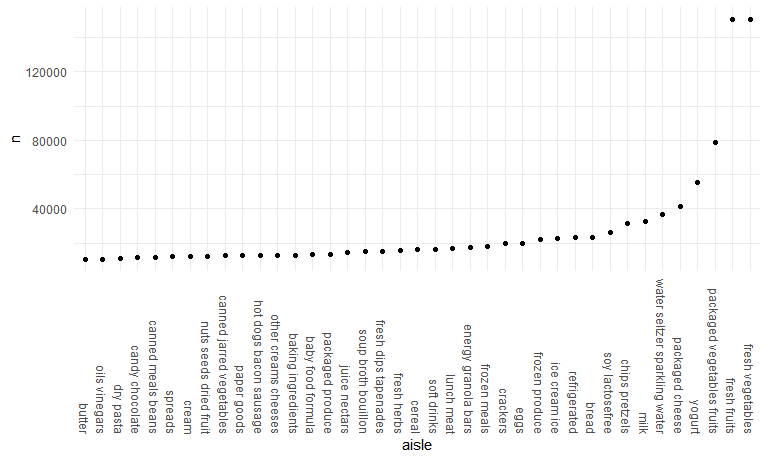
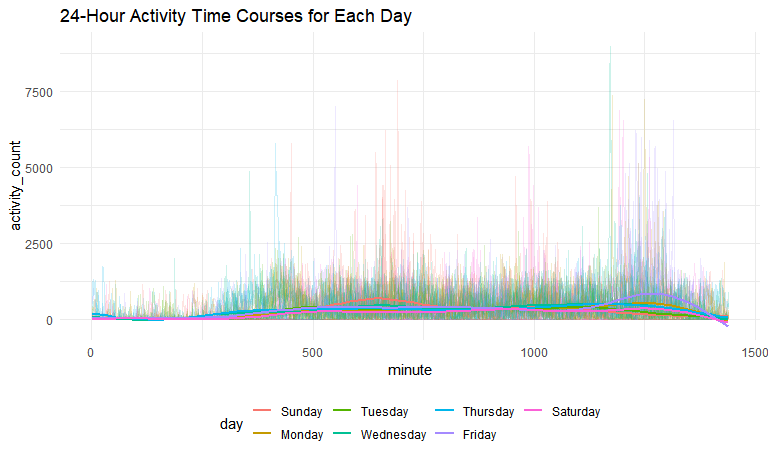
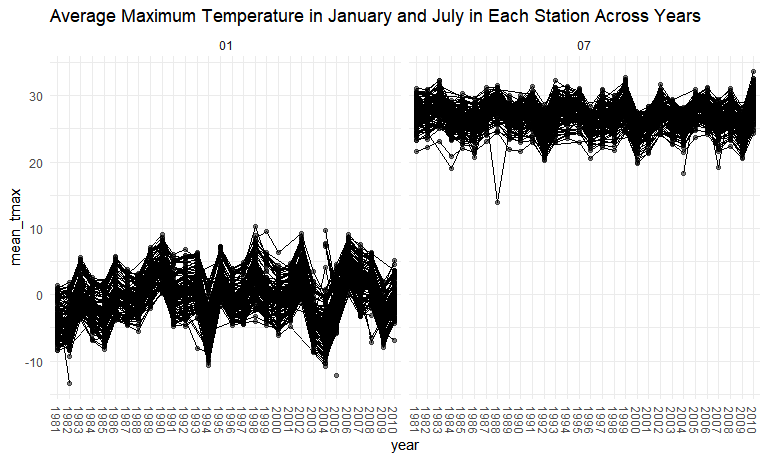
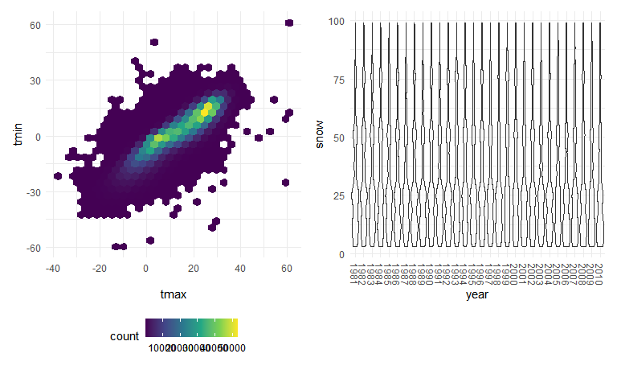

Homework 3
================
Na Yun Cho

``` r
library(tidyverse)
```

    ## -- Attaching packages --------------------------------------------------------------------------------- tidyverse 1.3.0 --

    ## v ggplot2 3.3.2     v purrr   0.3.4
    ## v tibble  3.0.3     v dplyr   1.0.2
    ## v tidyr   1.1.2     v stringr 1.4.0
    ## v readr   1.3.1     v forcats 0.5.0

    ## -- Conflicts ------------------------------------------------------------------------------------ tidyverse_conflicts() --
    ## x dplyr::filter() masks stats::filter()
    ## x dplyr::lag()    masks stats::lag()

``` r
library(p8105.datasets)
library(patchwork)
data("instacart")
data("ny_noaa")

knitr::opts_chunk$set(
  fig.width = 8,
  fig.asp = 0.6,
  fig.height = 0.6,
  out.width = "90%"
)

theme_set(theme_minimal() + theme(legend.position = "bottom"))

options(
  ggplot2.continuous.colour = "viridis",
  ggplot2.continuous.fill = "viridis"
)
```

# Problem 1

### Part 1) Number of aisles, identify aisles in which the most items were ordered from

``` r
instacart %>%
  count(aisle) %>%
  arrange(desc(n))
```

    ## # A tibble: 134 x 2
    ##    aisle                              n
    ##    <chr>                          <int>
    ##  1 fresh vegetables              150609
    ##  2 fresh fruits                  150473
    ##  3 packaged vegetables fruits     78493
    ##  4 yogurt                         55240
    ##  5 packaged cheese                41699
    ##  6 water seltzer sparkling water  36617
    ##  7 milk                           32644
    ##  8 chips pretzels                 31269
    ##  9 soy lactosefree                26240
    ## 10 bread                          23635
    ## # ... with 124 more rows

### Part 2) Make a plot of the number of items ordered in each aisle (n\>10000)

``` r
instacart %>%
  count(aisle) %>%
  filter(n > 10000) %>%
  mutate(
    aisle = factor(aisle), 
    aisle = fct_reorder(aisle, n)
  ) %>%
  ggplot(aes(x = aisle, y = n)) + 
  geom_point() +
  theme(axis.text.x = element_text(angle = 270 , vjust = 0.5, hjust = 1))
```



### Part 3) Show the three most popular items in each of the aisles

``` r
instacart %>%
  filter(aisle %in% c("baking ingredients", "dog food care", "packaged vegetable fruits")) %>%
  group_by(aisle) %>%
  count(product_name) %>%
  mutate(rank = min_rank(desc(n))) %>%
  filter(rank < 4) %>%
  arrange(aisle, rank) %>%
  knitr::kable()
```

| aisle              | product\_name                                 |   n | rank |
| :----------------- | :-------------------------------------------- | --: | ---: |
| baking ingredients | Light Brown Sugar                             | 499 |    1 |
| baking ingredients | Pure Baking Soda                              | 387 |    2 |
| baking ingredients | Cane Sugar                                    | 336 |    3 |
| dog food care      | Snack Sticks Chicken & Rice Recipe Dog Treats |  30 |    1 |
| dog food care      | Organix Chicken & Brown Rice Recipe           |  28 |    2 |
| dog food care      | Small Dog Biscuits                            |  26 |    3 |

### Part 4) Make a table that shows the mean hour of the day at which Pink Lady Apples and Coffee Ice Cream are ordered on each day of the week

``` r
instacart %>%
  filter(product_name %in% c("Pink Lady Apples", "Coffee Ice Cream")) %>%
  group_by(product_name, order_dow) %>%
  summarize(mean_hour = mean(order_hour_of_day)) %>%
  pivot_wider(
    names_from = order_dow,
    values_from = mean_hour
  )
```

    ## `summarise()` regrouping output by 'product_name' (override with `.groups` argument)

    ## # A tibble: 2 x 8
    ## # Groups:   product_name [2]
    ##   product_name       `0`   `1`   `2`   `3`   `4`   `5`   `6`
    ##   <chr>            <dbl> <dbl> <dbl> <dbl> <dbl> <dbl> <dbl>
    ## 1 Coffee Ice Cream  13.8  14.3  15.4  15.3  15.2  12.3  13.8
    ## 2 Pink Lady Apples  13.4  11.4  11.7  14.2  11.6  12.8  11.9

# Problem 2

### Part 1) Load, tidy, and wrangle the data

``` r
accel_df = read.csv("./data/accel_data.csv") %>%
  janitor::clean_names() %>%
  pivot_longer(
    activity_1:activity_1440, 
    names_to = "minute",
    names_prefix = "activity_", 
    values_to = "activity_count") %>%
  mutate(weekday_vs_weekend = recode(day, Monday = "weekday", Tuesday = "weekday", Wednesday = "weekday", 
                                     Thursday = "weekday", Friday = "weekday", Saturday = "weekend", Sunday = 
                                     "weekend")) %>%
  relocate(weekday_vs_weekend, .after = day) %>%
  mutate(
    minute = as.numeric(minute),
    day = as.factor(day), 
    day = fct_relevel(day, "Sunday", "Monday", "Tuesday", "Wednesday", "Thursday", "Friday", "Saturday"),
    weekday_vs_weekend = as.factor(weekday_vs_weekend))
```

Comment: The resulting dataset shows the accelerometer data collected on
a 63 year-old male with BMI 25, who was diagnosed with congestive heart
failure and was admitted to the Advaned Cardiac Care Center of Columbia
University Medical Center. More specifically, the data show the activity
counts per each minute every day during the five weeks the data was
collected from. The variables in this resulting dataset are week,
day\_id, day, weekday\_vs\_weekend, minute, activity\_count. The
variable ‘minute’ indicates which minute of the 24-hour day the activity
occurred starting at midnight, and ‘activity\_count’ denotes the count
of the activity that occurred per each minute. In this dataset, there
are a total of 50400 observations.

### Part 2) Create a table that shows the total minutes of activity for each day

``` r
accel_df %>% 
  group_by(day , week) %>%
  summarize(act_total = sum(activity_count)) %>%
  pivot_wider(
    names_from = day, 
    values_from = act_total)
```

    ## `summarise()` regrouping output by 'day' (override with `.groups` argument)

    ## # A tibble: 5 x 8
    ##    week Sunday  Monday Tuesday Wednesday Thursday  Friday Saturday
    ##   <int>  <dbl>   <dbl>   <dbl>     <dbl>    <dbl>   <dbl>    <dbl>
    ## 1     1 631105  78828. 307094.   340115.  355924. 480543.   376254
    ## 2     2 422018 295431  423245    440962   474048  568839    607175
    ## 3     3 467052 685910  381507    468869   371230  467420    382928
    ## 4     4 260617 409450  319568    434460   340291  154049      1440
    ## 5     5 138421 389080  367824    445366   549658  620860      1440

Comment: The resulting table shows the total minutes of activity per
each day for five weeks. It seems that generally the days around
weekends tend to show more peak activity counts than the weekdays. This
is shown by activity counts over 600,000 occurring on week1 of Sunday,
week3 of Monday, week5 of Friday, and week2 of Saturday whereas such
counts never occurred on Tuesday, Wednesday, or Thursday. However,
further analyses would have to be done to identify specific trends with
certainty, because the activity counts seem to be quite similar across
all days throughout each week. Furthermore, the table shows that two
Saturdays have significantly low numbers of activity counts compared to
activity counts of all the other days. From inspection of the dataset,
all the activity counts of these two Saturdays are recorded as ‘1’,
which could be due to mistake or errors.

### Part 3) Create a single-panel plot that shows the 24-hour activity time courses for each day

``` r
accel_df %>%
  ggplot(aes(x = minute, y = activity_count, group = day_id, color = day)) +
  geom_line(alpha = 0.2) + 
  geom_smooth(aes(group = day), se = FALSE) +
  labs(title = "24-Hour Activity Time Courses for Each Day")
```

    ## `geom_smooth()` using method = 'gam' and formula 'y ~ s(x, bs = "cs")'



Comment: The resulting graph shows the activity counts over 24-hours of
each day during the five weeks. It seems that the activity counts
generally cluster the most around 11:00am to 12pm (before and around 750
minutes) and around 8pm to 9:30 pm (before and around 1250 minutes). In
addition, there seems to be a peak in activity on Sunday around 11am
(before 750 minutes) and a peak in activity on Friday around 9pm (around
1250 minutes). Furthermore, according to the graph, I may be able to
infer that the person usually wakes up before 8am (before 500 minutes)
and goes to sleep around 10pm (around 1320 minutes).

# Problem 3

### Part 1) Clean the data, identify the most commonly observed values for snowfall

``` r
ny_noaa_df =
  ny_noaa %>% 
  separate(date, into = c("year", "month", "day"), sep = "-") %>%
  mutate(
    tmax = as.numeric(tmax),
    tmin = as.numeric(tmin),
    tmax = tmax/10,
    tmin = tmin/10,
    prcp = prcp/10
  )

ny_noaa_df %>%
  count(snow) %>%
  arrange(desc(n))
```

    ## # A tibble: 282 x 2
    ##     snow       n
    ##    <int>   <int>
    ##  1     0 2008508
    ##  2    NA  381221
    ##  3    25   31022
    ##  4    13   23095
    ##  5    51   18274
    ##  6    76   10173
    ##  7     8    9962
    ##  8     5    9748
    ##  9    38    9197
    ## 10     3    8790
    ## # ... with 272 more rows

Comment (before data cleaning): These data are accessed from the NOAA
National Climatic Data Center, and the data show the amount of
precipitation, snowfall, the depth of snow, and the maximum an minimum
temperatures on days ranging from January 1st 1981 to December 31st 2010
within New York State. The variables included in this dataset are id,
year, month, day, prcp, snow, snwd, tmax, tmin. The ‘id’ variable
indicates the weather station ID, ‘prcp’ indicates the amount of
precipitation in tenths of mm, ‘snow’ denotes snowfall in mm, ‘snwd’
denotes snow depth in mm, and ‘tmax’ and ‘tmin’ indicate the maximum and
minimum temperatures in tenths of degrees Celsius respectively. The
dataset has 2595176 rows and 9 columns. Some of the key variables of
this dataset would be ‘snow’, ‘tmax’, and ‘tmin’, but I can observe that
too many of the ‘tmax’, ‘tmin’, and ‘snow’ values are missing (written
as NA’s), which could affect the validity of the conclusions drawn from
this dataset.

Comment: The most commonly observed values for snowfall was 0, because
the dataset contains 2008508 observations of the value 0, which is the
largest number of observations among the observations of each of the
values of snowfall. This may be due to the fact that it does not snow
during most of the days in New York State.

### Part 2) Make a two-panel plot that shows the average maximum temperature in January and July across the years

``` r
ny_noaa_df %>% 
 filter(month %in% c("01", "07")) %>%
  group_by(id, year, month) %>%
  summarize(
    mean_tmax = mean(tmax, na.rm = TRUE)) %>%
  ggplot(aes(x = year, y = mean_tmax, group = id)) + 
  geom_point(alpha = 0.5) +
  geom_path() +
  facet_grid(.~month) +
  theme(axis.text.x = element_text(angle = 270, vjust = 0.5, hjust = 1)) +
  labs(title = "Average Maximum Temperature in January and July in Each Station Across Years")
```

    ## `summarise()` regrouping output by 'id', 'year' (override with `.groups` argument)

    ## Warning: Removed 5970 rows containing missing values (geom_point).

    ## Warning: Removed 5931 row(s) containing missing values (geom_path).



Comment: The two-panel plot shows the average maximum temperature in
January and in July in each station throughout the years of 1981 to
2010. The plot shows a slight increasing trend in the average maximum
temperature in January across the years, but it is hard to observe such
a trend in the average maximum temperature in July across the years.
Although the maximum temperatures are fairly consistent in both January
and July throughout the years, there seems to be more variation in
maximum temperatures in January than in July across the years. In
addition, the average maximum temperatures in January is much lower than
the average maximum temperatures in July. For the data in January, there
is one extreme outlier in 1982 that is lower than the values of the
other years. For the data in July, there is also a drastic outlier that
occurred in 1988 that is lower than the vaules of the other years. In
both January and July, there are also some other less drastic outliers
as well.

### Part 3 Make a two-panel plot of (i) tmax vs tmin & (2) distribution of snowfall greater than 0 less than 100 by year

``` r
tmax_vs_tmin = 
  ny_noaa_df %>%
  ggplot(aes(x = tmax, y = tmin)) + 
  geom_hex()

snowfall_dist = 
  ny_noaa_df %>% 
  filter(snow < 100) %>%
  filter(snow > 0) %>%
  ggplot(aes(x = year, y = snow)) + geom_violin(alpha = 0.5) + 
  theme(axis.text.x = element_text(angle = 270, vjust = 0.5, hjust = 1))

tmax_vs_tmin + snowfall_dist 
```

    ## Warning: Removed 1136276 rows containing non-finite values (stat_binhex).



Comment: The two-panel plot includes the (i) hex plot showing tmax vs
tmin for the dataset and (ii) violin plot showing the distribution of
snowfall values greater than 0 and less than 100 for every year.

The hex plot indicates that although there is some variability
throughout the dataset, most of the data cluster around the center of
the distribution. There also seems to be some cases where the maximum
temperature is lower than the minimum temperature, which would reduce
the accuracy of the conclusions drawn from the dataset.

The violin plot shows that most of the annual snowfalls are between 0mm
and 35mm across the years. The plot also indicates that annual snowfalls
also tend to cluster around the values of 50 mm and 70 mm of snow across
the years. These clusters are fairly consistent throughout the years.
