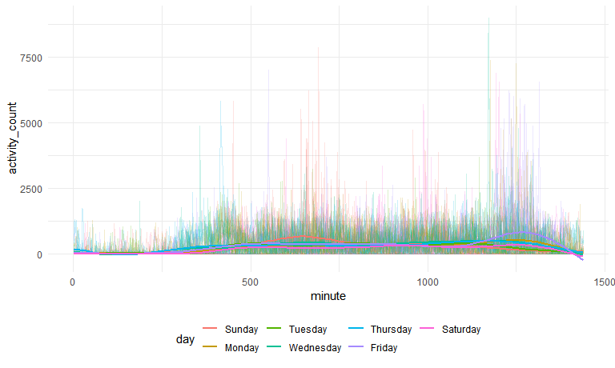

Homework 3
================
Na Yun Cho

``` r
library(tidyverse)
```

    ## -- Attaching packages --------------------------------------------------------------------------------- tidyverse 1.3.0 --

    ## v ggplot2 3.3.2     v purrr   0.3.4
    ## v tibble  3.0.3     v dplyr   1.0.2
    ## v tidyr   1.1.2     v stringr 1.4.0
    ## v readr   1.3.1     v forcats 0.5.0

    ## -- Conflicts ------------------------------------------------------------------------------------ tidyverse_conflicts() --
    ## x dplyr::filter() masks stats::filter()
    ## x dplyr::lag()    masks stats::lag()

``` r
library(p8105.datasets)
data("ny_noaa")

knitr::opts_chunk$set(
  fig.width = 8,
  fig.asp = 0.6,
  fig.height = 0.6,
  out.width = "90%"
)

theme_set(theme_minimal() + theme(legend.position = "bottom"))

options(
  ggplot2.continuous.colour = "viridis",
  ggplot2.continuous.fill = "viridis"
)
```

# Problem 2

``` r
accel_df = read.csv("./data/accel_data.csv") %>%
  janitor::clean_names() %>%
  pivot_longer(
    activity_1:activity_1440, 
    names_to = "minute",
    names_prefix = "activity_", 
    values_to = "activity_count"
  ) %>%
  mutate(
    minute = as.numeric(minute),
    day = factor(day),
    day = fct_relevel(day, "Sunday", "Monday", "Tuesday", "Wednesday", "Thursday", "Friday", "Saturday"),
    weekend = as.numeric(day %in% c("Saturday", "Sunday")),
    weekend = recode(weekend, '1' = "weekend", '0' = "weekday"))
```

``` r
accel_df %>% 
  group_by(day , week) %>%
  summarize(act_total = sum(activity_count)) %>%
  pivot_wider(
    names_from = day, 
    values_from = act_total)
```

    ## `summarise()` regrouping output by 'day' (override with `.groups` argument)

    ## # A tibble: 5 x 8
    ##    week Sunday  Monday Tuesday Wednesday Thursday  Friday Saturday
    ##   <int>  <dbl>   <dbl>   <dbl>     <dbl>    <dbl>   <dbl>    <dbl>
    ## 1     1 631105  78828. 307094.   340115.  355924. 480543.   376254
    ## 2     2 422018 295431  423245    440962   474048  568839    607175
    ## 3     3 467052 685910  381507    468869   371230  467420    382928
    ## 4     4 260617 409450  319568    434460   340291  154049      1440
    ## 5     5 138421 389080  367824    445366   549658  620860      1440

``` r
accel_df %>%
  ggplot(aes(x= minute, y= activity_count, group = day_id, color = day)) +
  geom_line(alpha =0.2) + 
  geom_smooth(aes(group = day), se = FALSE)
```

    ## `geom_smooth()` using method = 'gam' and formula 'y ~ s(x, bs = "cs")'



# Problem 3

``` r
ny_noaa_df =
  ny_noaa %>% 
  separate(date, into = c("year", "month", "day"), sep = "/") %>%
  mutate(
    tmax = as.numeric(tmax),
    tmin = as.numeric(tmin),
    tmax = tmax/10,
    tmin = tmin/10,
    prcp = prcp/10
  )
```

    ## Warning: Expected 3 pieces. Missing pieces filled with `NA` in 2595176 rows [1,
    ## 2, 3, 4, 5, 6, 7, 8, 9, 10, 11, 12, 13, 14, 15, 16, 17, 18, 19, 20, ...].

``` r
ny_noaa_df %>%
  count(snow) %>%
  arrange(desc(n))
```

    ## # A tibble: 282 x 2
    ##     snow       n
    ##    <int>   <int>
    ##  1     0 2008508
    ##  2    NA  381221
    ##  3    25   31022
    ##  4    13   23095
    ##  5    51   18274
    ##  6    76   10173
    ##  7     8    9962
    ##  8     5    9748
    ##  9    38    9197
    ## 10     3    8790
    ## # ... with 272 more rows

``` r
ny_noaa_df %>% 
 filter(month %in% c("1", "7")) %>%
  group_by(id, year, month) %>%
  summarize(
    mean_tmax = mean(tmax, na.rm = TRUE)) %>%
  ggplot(aes(x = year, y = mean_tmax, group = id)) + 
  geom_point(alpha = 0.5, size = 0.5) +
  geom_path()
```

    ## `summarise()` regrouping output by 'id', 'year' (override with `.groups` argument)


``` r
tamx_vs_tmin = 
  ny_noaa_df %>%
  ggplot(aes(x = tmax, y = tmin)) + 
  geom_hex()
```
